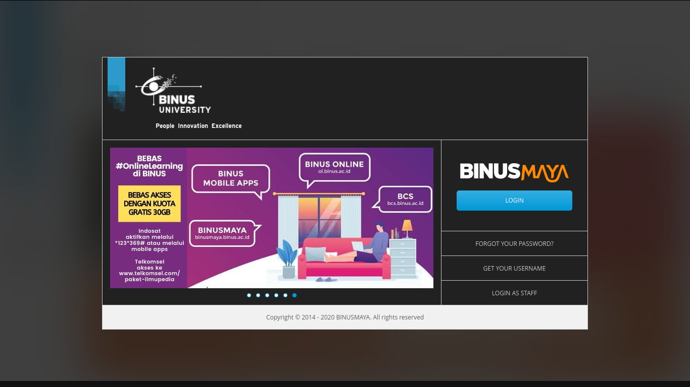
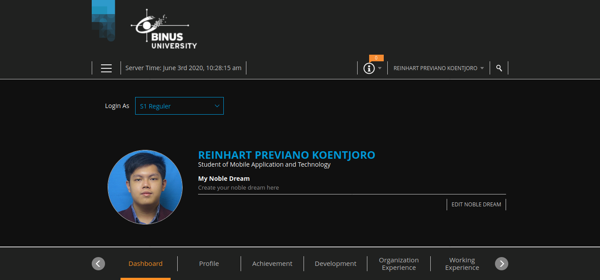
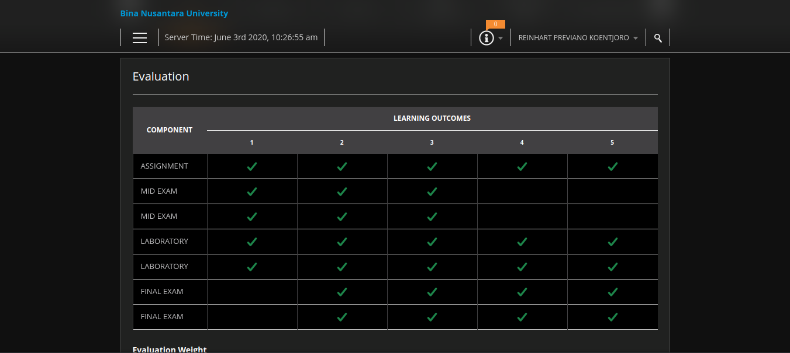

# Dark Mode for BINUSMAYA

## Screenshots

## How to Install/Apply
1. Install [Stylus](https://add0n.com/stylus.html) addon (for [Chrome](https://chrome.google.com/webstore/detail/stylus/clngdbkpkpeebahjckkjfobafhncgmne) | [Firefox](https://addons.mozilla.org/firefox/addon/styl-us/) | [Opera](https://addons.opera.com/extensions/details/stylus/))
2. Go to [BINUSMAYA](https://binusmaya.binus.ac.id/)
3. Click the Stylus icon (on toolbar) and create a new rule for *binusmaya.binus.ac.id*
4. Copy and paste the contents of one of the following file:
   + **main.css** - enforce Dark Mode by default
   + **main-auto.css** - enforce Dark Mode based on the device theme settings (Android 10, iOS 13, Linux, macOS Mojave, Windows 10)
5. Click **Save** (or `Ctrl + S`) the Stylus editor to apply changes

## Compatibility
This userstyle is compatible with all major browsers (specifically, supporting the [CSS `filter` property](https://developer.mozilla.org/en-US/docs/Web/CSS/filter)). This theme is also compatible with certain BINUSMAYA 3 webpages (e.g. mandatory online forms and **Print KMK**) while not being fully tested on First Year Program courses page.

## License
[MIT License](https://github.com/reinhart1010/binusmaya-dark-mode/blob/master/LICENSE)

This project is neither created nor endorsed by [BINUS UNIVERSITY](http://binus.ac.id) and/or [BINA NUSANTARA IT Division](http://ict.binus.edu/)
